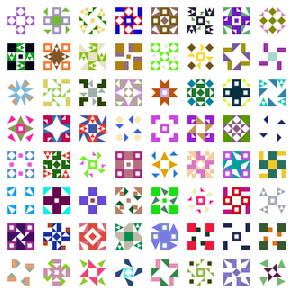

# Identicons in Golang

A kinda customizeable identicon implementation based on Bitmessage qidenticon

## Sample icons



## Example

### Basic

```golang
package main

import (
	"image/png"
	"os"

	"github.com/fivenp/go-identicon"
)

func main() {
	code := identicon.Code("test")
	size := 30
	settings := identicon.DefaultSettings()
	img := identicon.Render(code, size, settings)
	w, err := os.Create("test.png")
	if err != nil {
		panic(err)
	}
	defer w.Close()
	err = png.Encode(w, img)
	if err != nil {
		panic(err)
	}
}
```

### Advanced

Check the [demo](demo/) folder...
